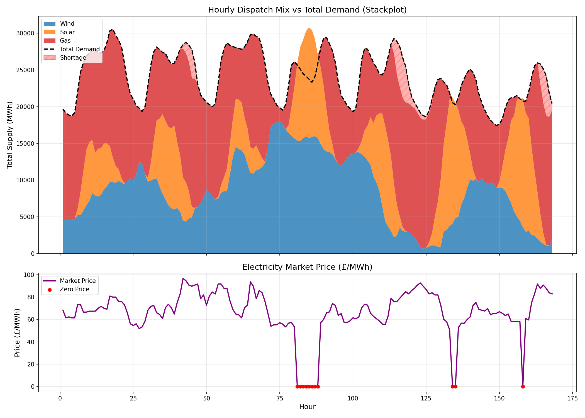

# Auction Process Simulator

## Overview
This project simulates a Auction process for the electricity market. It calculates the price (£/MWh) and the generation mix (Wind, Solar, Gas) for every hour based on a Dispatch Algorithm, which is built using an OOP architecture to ensure data integrity and extensibility.

## Simulation Results

### 1. Visualisation
The chart below illustrates the hourly dispatch stackplot.



### 2. Output Data
The detailed hourly breakdown (Marginal Price, Generation Mix, Shortage Amount) has been exported to CSV:

**[Download Full Report (CSV)](hourly_prices_and_mix_report.csv)**

---

## Design

### 1. Architecture: OOP vs. Script
This task could have been done in Script, but I chose to implement it using an Object-Oriented approach (`AuctionProcessSimulator` class). Since data ingestion, validation, and calculation can be decoupled. And the use of the class maintains the state of the simulation, making it easier to extend for future scenarios, such as sensitivity analysis on gas prices.

### 2. Defensive Programming
To prevent "Silent Failures," I implemented a strict Data Alignment Check before simulation by choosing the `Demand` dataset as the master timeline. Instead of using `assert`, I used explicit `if-raise` logic to ensure all input datasets align well with the Demand timestamp.

### 3. Vectorised Calculation
The calculation using NumPy matrix dot products (`matrix.dot`) rather than row-by-row iteration for better performance.

---

## Methodology 

### Logic
 Step 1: Calculate the total generation of Wind and Solar as they are free (Marginal price = 0), and subtracted it from Total Demand. \
 Step 2: The remaining "Net Demand" is met by Gas plants, sorted and stacked by efficiency (Descending). Higher efficiency = Lower marginal price.

### Different Conditions
  * Surplus: If Supply of Wind and Solar > Demand, Price = £0/MWh.
  * Normal: Price is set by the bid of the last dispatched gas plant.
  * Shortage: If Demand > Supply, the price remains at the highest available bid, and the unserved energy is recorded as `Supply_Shortage_MWh`.

### Unit Conversion
* The Gas Price Input is in `pence/Therm`. To convert it into `pound/MWh`, we divide by 100 and multiply by 34.121 as given.
---

## How to Run

### Prerequisites
* Python 3.x
* Dependencies listed in `requirements.txt`

### Installation
```bash
pip install -r requirements.txt

